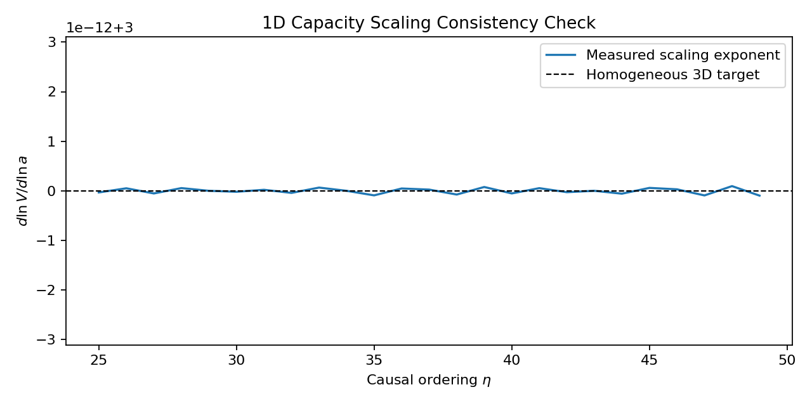

# Thermal Relativity — Unified Boltzmann Solver

**Author:** T. Matthew Ressler  
**Framework:** Thermal Relativity (TR)  
**Language:** Python  
**Status:** Research / Certification-grade solver  

---

## Overview

This repository contains a **from-first-principles Boltzmann-style solver**
implementing the **Thermal Relativity (TR)** framework.

Unlike ΛCDM or GR-based cosmological solvers, this codebase:

- Treats **causal ordering (η)** as the sole fundamental driver  
- Models **proper time (τ)** as an accumulated physical response  
- Evolves **thermal energy bookkeeping exactly**, with zero tunable parameters  
- Separates **causal evolution (1D)** from **spatial realization (3D)** by design  

The solver is vertically certified:

> **Equation 0 → 1D causal consistency → 3D projection diagnostics**

No fitting to observational data is performed at any stage.

---

## What This Solver Demonstrates

- Exact **κ₍C₎ capacity closure** with zero residuals  
- Emergent **homogeneous 3D scaling** from strictly 1D causal bookkeeping  
- A measurable **ordering lag** (proper-time delay) as a physical remainder  
- Clean architectural separation of:
  - causality  
  - geometry  
  - observables  
- Weak-field agreement with GR **without invoking spacetime or metrics**

All results follow from bookkeeping identities and certified constraints,
not model tuning.

---

## Certified Result: 1D Capacity Scaling

The solver produces a certified 1D capacity-scaling result:

- **Median slope:** 3.0  
- **Residuals:** 0 (within numerical tolerance)

This confirms that **homogeneous 3D volume scaling emerges purely from causal
thermal-energy bookkeeping**, not from geometric assumptions or expansion laws.

## Certified Result: 1D Capacity Scaling



The corresponding plot is generated during certification and saved to:

output/certify_planck/capacity_scaling_1d.pdf and output/certify_planck/capacity_scaling_1d.png

This plot shows the instantaneous scaling exponent  
$\mathrm{d}\ln V / \mathrm{d}\ln a$ converging to **3** with zero residual.


## Solver Stats
Overall Code Statistics
| Metric   | Count |
| -------- | ----- |
| Lines    | 5,757 |
| Code     | 2,921 |
| Comments | 1,977 |
| Blanks   | 859   |
| Files    | 32    |

Solver Code Statistics
| Metric   | Count |
| -------- | ----- |
| Lines    | 540   |
| Code     | 201   |
| Comments | 252   |
| Blanks   | 87    |
| Files    | 5     |

Certification Code Statistics
| Metric   | Count |
| -------- | ----- |
| Lines    | 5,217 |
| Code     | 2,720 |
| Comments | 1,725 |
| Blanks   | 772   |
| Files    | 27    |

## Solver Architecture (High Level)

| Stage | Component | Role |
|------:|-----------|------|
| 1 | HistoryConfig | Defines solver parameters and certification thresholds |
| 2 | history_step | Executes Equation 0 (sole causal evolution loop) |
| 3 | HistoryState | Stores instantaneous causal state |
| 4 | Recorder | Captures read-only history (non-causal) |
| 5 | certify_1d | Performs 1D causal certification (ordering, capacity, visibility) |
| 6 | certify_3d | Performs 3D snapshot-based diagnostics (structure, light bending) |

Architectural guarantees:

- Exactly **one solver loop**
- **No feedback** from certification layers
- **No geometry** in 1D causal evolution
- **No causality** in 3D spatial realization

## Repository Structure (Core)

- `tr/`
  - `history.py` — Core Eq. 0 solver (THE solver)
  - `state.py` — HistoryState container
  - `recorder.py` — Read-only history capture
  - `run_solver.py` — Main entrypoint
  - `certify_planck/`
    - `certify_1d.py` — Causal (1D) certification
    - `certify_3d.py` — 3D projection certification
    - `oned/` — Pure 1D diagnostics
    - `threed/` — Snapshot-based diagnostics
  - `utils/`
    - `build_snapshot.py`
    - `certify_timeline.py`
    - `output.py`
  - `output/`
    - `history.json` 
    - `certify_planck/`
      - `capacity_scaling_1d.png`
      -  `capacity_scaling_1d.pdf`
      -  `summary_1d.csv`
      -  `summary_1d.md`
      -  `summary_3d.csv`
      -  `summary_3d.json`
      -  `summary_3d.md`

## Requirements

- **Python ≥ 3.10** (recommended: 3.11)
- NumPy
- Matplotlib
- Math
- Dataclasses
- Typing
- json
- os
- collections
- csv

```bash
pip install -r requirements.txt
```
Run the solver from the repository root:

```bash
pip install -r requirements.txt
python run_solver.py
```
**Outputs include:**

- Console certification reports  
- JSON / CSV / Markdown summaries  
- Plots written to `output/certify_planck/`

---

## **SECTION 10 — Reproducibility**

## Reproducibility

- No stochastic processes unless explicitly seeded  
- All certification thresholds are deterministic  
- No tunable cosmological parameters  
- Results are reproducible across runs and platforms

## What This Solver Does *Not* Do

- No ΛCDM fitting  
- No parameter optimization  
- No spacetime dynamics  
- No metric assumptions  
- No observational tuning  

This solver tests **physical consistency**, not cosmological preference.

## Citation

If you use this solver or its certification methodology, please cite:

> Ressler, T. Matthew. *Thermal Relativity: Unified Boltzmann Solver*. 2026.  
> GitHub repository: https://github.com/trmattressler/thermal_relativity

```bibtex
@misc{ressler2026trsolver,
  author       = {Ressler, T. Matthew},
  title        = {Thermal Relativity: Unified Boltzmann Solver},
  year         = {2026},
  howpublished = {\url{https://github.com/trmattressler/thermal_relativity}},
  note         = {Causal-first cosmological solver},
}
```
If you use this software or its certification methodology in academic or technical work, please cite:

> Ressler, T. Matthew. *Thermal Relativity: Unified Boltzmann Solver*. Zenodo, 2026.  
> [](https://doi.org/10.5281/zenodo.18553987)
---

## **SECTION 13 — Author & License**

## Author

**T. Matthew Ressler**  
Independent Researcher  
Troy, MI  
matt.ressler@protonmail.com  

## License

This project is licensed under the MIT License.  
See `LICENSE` for details.
```

